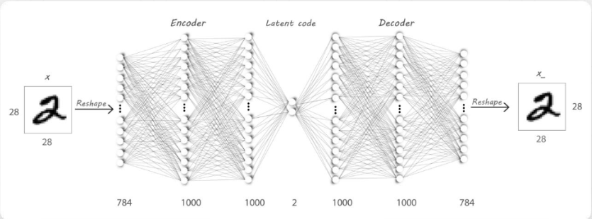
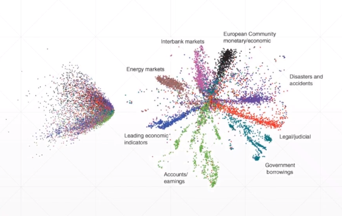

# TensorFlow2自编码器

## 简介
深度学习中也有很多无监督学习的算法，其中，自编码器是最为典型的代表。事实上，人工标注的数据毕竟是少数，互联网每天都在产生海量的无标签数据，如何利用这些数据就是无监督学习研究的重点。自编码器被广泛应用于特征提取（数据降维），其降维后的数据，样本之间保留了较多的相关信息。

## 自编码器
对自编码器这种结构，进行无监督学习的方法就是将输入作为输出，尽可能通过先降维后升维的运算后，保持输入的不变性，从而，降维后的数据包含更多原始的信息。所以，自编码器的端到端过程其实是一个数据重建过程。

关于自编码器的训练，对于不同的数据（二分输入或真值输入）采用不同的损失函数（MSE或CE）。相比于PCA这类矩阵运算方法，自编码器由于非线性特性，丢失信息较少；而且PCA降维后的数据，可解释性变得很低，而AE降维后的数据解释性强且具有聚类效果。
下图左侧为PCA降维后各类数据的二维显示，右侧为自编码器的效果。

## 自编码器变种
Denoising AutoEncoders（降噪自编码器），训练时将原始数据加入随机噪声（如高斯噪声），这样，自编码器模型可以较好地从噪声图片中还原真实图片。

Adversarial AutoEncoders

## 补充说明
- 本文介绍了Auto-Encoder在TensorFlow2中的实现，更详细的可以查看官方文档。
- 具体的代码同步至[我的Github仓库](https://github.com/luanshiyinyang/Tutorial/tree/TensorFlow2)欢迎star；博客同步至我的[个人博客网站](https://luanshiyinyang.github.io)，欢迎查看其他文章。
- 如有疏漏，欢迎指正。