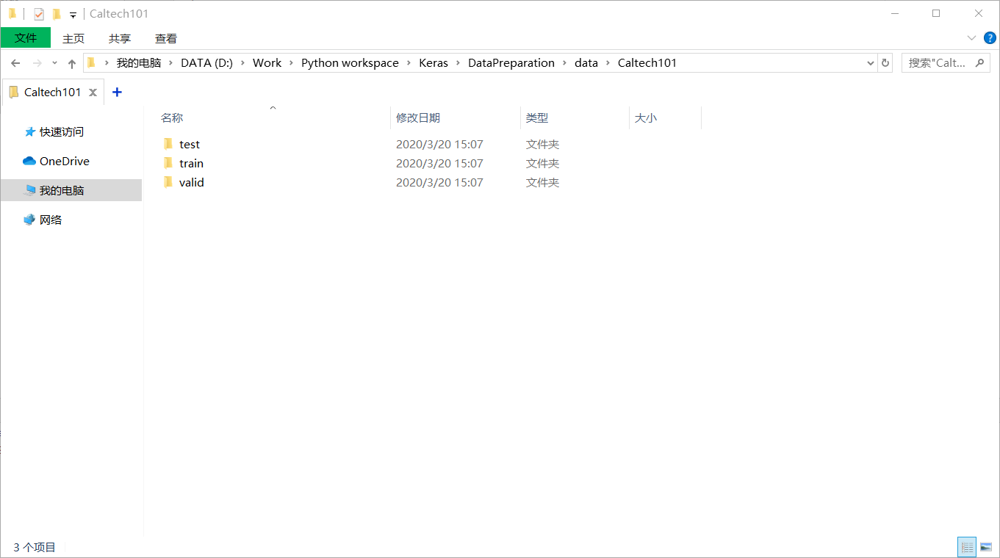
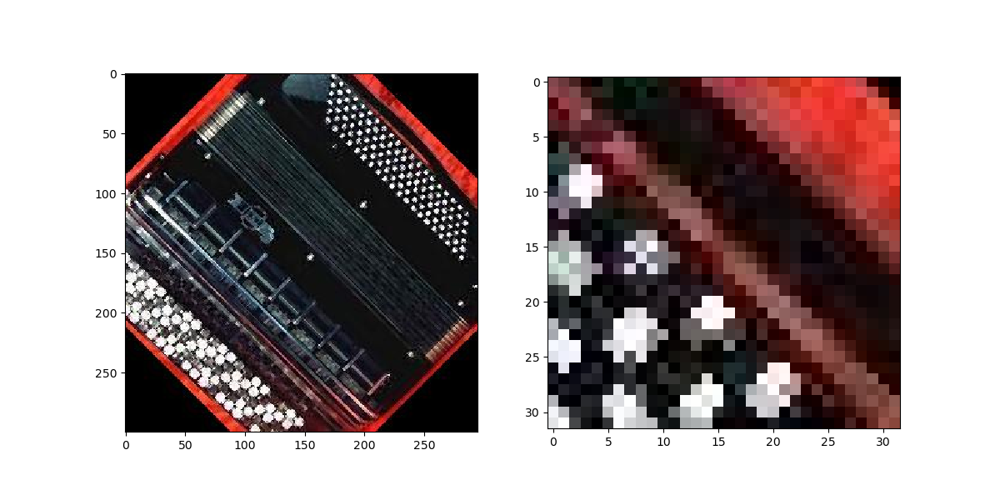
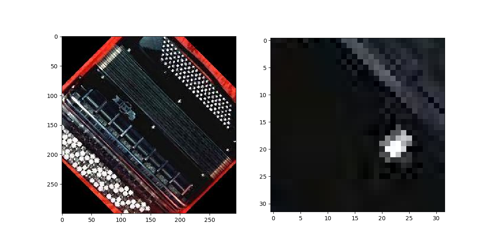

# PyTorch数据准备


## 简介
没有数据，所有的深度学习和机器学习都是无稽之谈，本文通过Caltech101图片数据集介绍PyTorch如何处理数据（包括数据的读入、预处理、增强等操作）。


## 数据集构建
本文使用比较经典的Caltech101数据集，共含有101个类别，如下图，其中`BACKGROUND_Google`为杂项，无法分类，使用该数据集时删除该文件夹即可。


对数据集进行划分，形成如下格式，划分为训练集、验证集和测试集，每一种数据集中每个类别按照8:1:1进行数据划分，具体代码见`scripts/dataset_split.py`。



数据划分完成后就要制作相关的**数据集说明文件**，在很多大型的数据集中经常看到这种文件且一般是csv格式的文件，该文件一般存放所有图片的路径及其标签。生成了三个说明文件如下，图中示例的是训练集的说明文件。这部分的具体代码见`scripts/generate_desc.py`。


## PyTorch数据读取API
上面构造了比较标准的数据集格式和主流的数据集说明文件，那么PyTorch如何识别这种格式的数据集呢？事实上，PyTorch对于数据集导入进行了封装，其API为torch.utils.data中的Dataset类，只要继承自该类即可自定义数据集。 

需要注意的是Dataset类的最主要的重载方法为`__getitem__`方法，该方法需要传入一个index的list（索引的列表），根据该列表去取出多个数据元素，每个元素是一个样本（这里指图片和标签）。

下面的代码构建了一个最简单的Dataset，事实上训练时需要定义很多预处理和增强方法，这里略过。

```python
from torch.utils.data import Dataset
import pandas as pd
from PIL import Image


class MyDataset(Dataset):

    def __init__(self, desc_file, transform=None):
        self.all_data = pd.read_csv(desc_file).values
        self.transform = transform

    def __getitem__(self, index):
        img, label = self.all_data[index, 0], self.all_data[index, 1]
        img = Image.open(img).convert('RGB')
        if self.transform is not None:
            img = self.transform(img)
        return img, label

    def __len__(self):
        return len(self.all_data)


if __name__ == '__main__':
    ds_train = MyDataset('../data/desc_train.csv', None)


```

在成功构建这个Dataset之后就是将这个Dataset对象交给Dataloader，实例化的Dataloader会调用Dataset对象的`__getitem__`方法读取一张图片的数据和标签并拼接为一个batch返回，作为模型的输入。

下面示例讲解**如何在PyTorch中读取数据集**。
1. 首先，需要构造Dataset对象，该对象定义了本地数据的路径和图片的转换方法（预处理方法）。**这里提一下，这个数据转换的方法是一个`transforms.Compose`对象，它从一个列表构建，列表中每个元素是一种处理方法。**
2. 接着，构造Dataloader对象，该对象成批调用Dataset对象的`__getitem__`方法获得批量变换后的数据返回，用于模型训练。
3. 训练完成，释放内存，进行下一批数据读取。

实验效果如下，可以看到，按批次取出了数据和标签。


其代码如下。

```python
from my_dataset import MyDataset
from torch.utils.data import DataLoader
from torchvision.transforms import transforms


desc_train = '../data/desc_train.csv'
desc_valid = '../data/desc_valid.csv'
batch_size = 16
lr_init = 0.001
epochs = 10

normMean = [0.4948052, 0.48568845, 0.44682974]
normStd = [0.24580306, 0.24236229, 0.2603115]
train_transform = transforms.Compose([
    transforms.Resize(32),
    transforms.RandomCrop(32, padding=4),
    transforms.ToTensor(),
    transforms.Normalize(normMean, normStd)  # 按照imagenet标准
])

valid_transform = transforms.Compose([
    transforms.ToTensor(),
    transforms.Normalize(normMean, normStd)
])

# 构建MyDataset实例
train_data = MyDataset(desc_train, transform=train_transform)
valid_data = MyDataset(desc_valid, transform=valid_transform)

# 构建DataLoder
train_loader = DataLoader(dataset=train_data, batch_size=batch_size, shuffle=True)
valid_loader = DataLoader(dataset=valid_data, batch_size=batch_size)


for epoch in range(epochs):
    for step, data in enumerate(train_loader):
        inputs, labels = data
        print("epoch", epoch, "step", step)
        print("data shape", inputs.shape, labels.shape)
```


## 数据增强
在实际使用中，数据进入模型之前会进行一些对应的预处理，如数据中心化、数据标准化，随机裁减、图片旋转、镜像翻转，PyTorch预先定义了诸多数据增强方法，这些都放在torchvision的transforms模块下。官方文档只是罗列了相关API，没有按照逻辑整理，其实数据增强主要有四大类。
- 裁减
- 转动
- 图像变换
- transform操作

下面逐一介绍。
### 裁减（Crop）
- 随机裁减
  - `transforms.RandomCrop(size, padding=None, pad_if_needed=False, fill=0, padding_mode='constant')`
  - 根据给定的size进行随机裁减。
  - **size**参数为裁减后的图像尺寸，为元组或者整型数，若为元组要符合`(height, width)`格式，若int型数则自动按照`(size, size)`进行长宽设定。
  - **padding**参数设置需要填充多少个像素，为元组或者整形数，若为整形数则图像上下左右填充`padding`个像素，若两个数字的元组则第一个数字表示左右第二个数字表示上下，若四个数字则分别表示上下左右填充的像素个数。
  - **fill**参数设置填充的值是什么，为整型或者元组只有`padding_mode`为`constant`时有效，当int时，各个通道填充该值，三个数的元组时RGB三通道分别填充。
  - **padding_mode**参数设置填充模式，`constant`表示常量填充，`edge`表示按照图片边缘像素值填充，`reflect`根据反射进行填充，`symmetric`同前一个的效果但会重复边上的值。
  - 下图左侧为原图，右侧为随机裁减的结果。
- 中心裁减
  - `transforms.CenterCrop(size)`
  - 根据给定的size从中心进行裁减。
  - **size**参数设置裁减后的图片大小，为整型或者元组，若为元组要符合`(height, width)`格式，若int型数则自动按照`(size, size)`进行长宽设定。
  - 下图左侧为原图，右侧为随机裁减的结果。
- 随机长宽比裁减
  - 


## 补充说明
这个系列的PyTorch教程我没有按照之前[TensorFlow2系列教程](https://blog.csdn.net/zhouchen1998/category_9370890.html)那样进行由浅入深的展开，即从基础张量运算API到模型训练以及主流的深度模型构建这样的思路，而是按照深度方法端到端的思路展开的，即数据准备、模型构建。损失及优化、训练可视化这样的思路。这是因为PyTorch的基础运算操作类似于Numpy和TensorFlow，我在之前的TensorFlow教程中以及介绍过了。

本文涉及的项目代码均可以在[我的Github](https://github.com/luanshiyinyang/Tutorial/tree/PyTorch)找到，欢迎star或者fork。因为篇幅限制，较为简略，如有疏漏，欢迎指出。
 