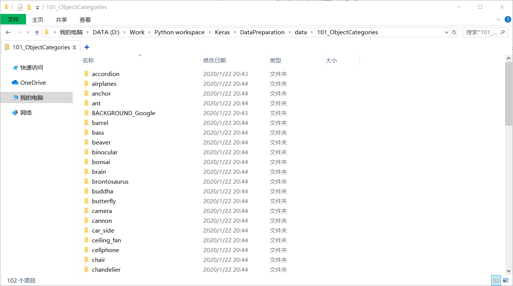
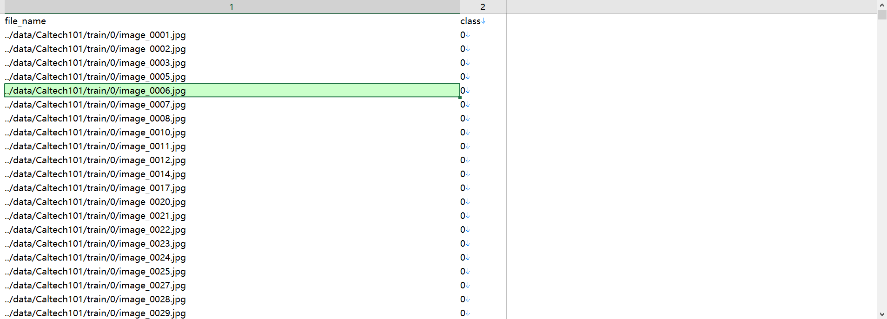

# Keras 数据准备

## 简介

本文主要以 Caltech101 图片数据集为例，讲解 Keras 中的数据处理模块（数据读入、预处理、增强等）。

## 数据集构建

本文使用比较经典的 Caltech101 数据集，共含有 101 个类别，如下图，其中`BACKGROUND_Google`子文件夹为杂项，无法分类，使用该数据集时删除该文件夹即可。



这里不妨将数据集重构为常见数据集格式，这样便于后面说明 Keras 的数据加载 API。具体重构数据集的代码可在文末 Github 找到，这里不做赘述，最后生成数据集如下，分为训练集、验证集和测试集（比例 8:1:1），每个文件夹下有 101 个子文件夹代表 101 个类别的图片。


数据划分完成后就要制作相关的**数据集说明文件**，在很多大型的数据集中经常看到这种文件且一般是**csv 格式**的文件，该文件一般存放所有图片的路径及其标签（包含的就是所有数据的说明）。生成了三个说明文件如下，图中示例的是训练集的说明文件。这部分的具体代码也可以在文末 Github 找到。



## Keras数据读取API
上一节，构建了比较标准的数据集及数据集说明文件，Keras对于标准格式存储的数据集封装了非常合适的数据加载相关的API，这部分API都在Keras模块下的preprocessing模块中，主要封装三种格式的数据，分别为图像、序列、文本（对应模块名为image，sequence，text），本系列文章均以图像数据为主，其他类型数据加载可以查看TensorFlow官方文档[相关部分](https://www.tensorflow.org/api_docs/python/tf/keras/preprocessing/)。

`tf.keras.preprocessing.image`下封装了一些方法如`img_to_array`、`array_to_img`、`load_img`、`save_img`等，但是这些都是琐碎的对具体图片的处理，对整个数据集进行处理的关键是`tf.keras.preprocessing.image.ImageDataGenerator`这个类，我们通过该类实例化一个数据集生成器对象，该对象不包含具体数据集的数据，只含有对数据的处理手段。

具体参数如下，包含大部分常用的数据增强的方法如ZCA白化、图像标准化、随机旋转、随机平移、翻转等，具体参数含义可以查看[我关于Keras数据增强的文章](https://zhouchen.blog.csdn.net/article/details/97495460)，这里不多赘述。

```python
tf.keras.preprocessing.image.ImageDataGenerator(
    featurewise_center=False, samplewise_center=False,
    featurewise_std_normalization=False, samplewise_std_normalization=False,
    zca_whitening=False, zca_epsilon=1e-06, rotation_range=0, width_shift_range=0.0,
    height_shift_range=0.0, brightness_range=None, shear_range=0.0, zoom_range=0.0,
    channel_shift_range=0.0, fill_mode='nearest', cval=0.0, horizontal_flip=False,
    vertical_flip=False, rescale=None, preprocessing_function=None,
    data_format=None, validation_split=0.0, dtype=None
)
```

这里构造三个生成器，对应训练集、验证集、测试集，由于训练集用于训练可以进行数据增强（简单进行了翻转、旋转等预处理方法），验证集和测试集为了验证模型效果，不能进行数据增强。
```python
train_gen = keras.preprocessing.image.ImageDataGenerator(
    rescale=1/255.,
    horizontal_flip=True,
    shear_range=0.2,
    width_shift_range=0.1
)
valid_gen = keras.preprocessing.image.ImageDataGenerator(
    rescale=1/255.
)
test_gen = keras.preprocessing.image.ImageDataGenerator(
    rescale=1/255.
)
```

获得设定了数据预处理方法的数据集生成器，那么具体的数据怎么读取呢？事实上，`ImageDataGenerator`对象封装了三个flow开头的方法，分别为`flow`、`flow_from_directory`以及`flow_from_dataframe`。`flow`表示从张量中批量产生数据，会迭代返回直到取完整个张量，使用不多；`flow_from_directory`和`flow_from_dataframe`是很常用的数据加载方法，他们依据数据集文件夹或者数据集说明文件读取Dataframe到本地进行数据读取，每次读取一个批次，占用内存和显存较小，符合实际训练需求。

```python
flow(
    x,
    y=None,
    batch_size=32,
    shuffle=True,
    sample_weight=None,
    seed=None,
    save_to_dir=None,
    save_prefix='',
    save_format='png',
    subset=None
)
```
```python
flow_from_directory(
    directory,
    target_size=(256, 256),
    color_mode='rgb',
    classes=None,
    class_mode='categorical',
    batch_size=32,
    shuffle=True,
    seed=None,
    save_to_dir=None,
    save_prefix='',
    save_format='png',
    follow_links=False,
    subset=None,
    interpolation='nearest'
)
```
```python
flow_from_dataframe(
    dataframe,
    directory=None,
    x_col="filename",
    y_col="class",
    weight_col=None,
    target_size=(256, 256),
    color_mode='rgb',
    classes=None,
    class_mode='categorical',
    batch_size=32,
    shuffle=True,
    seed=None,
    save_to_dir=None,
    save_prefix='',
    save_format='png',
    subset=None,
    interpolation='nearest',
    validate_filenames=True,
    **kwargs
)
```

上述三个数据生成的方法具体参数在[我的数据增强博文](https://zhouchen.blog.csdn.net/article/details/97495460)中解释了常用的一些，其他的可以参考官方文档。

例如，使用`flow_from_directory`读取上一节生成数据集的训练集，具体代码和结果如下（第一行输出是因为generator获得具体数据后会进行一个默认信息的输出，共6907张图片，按照给定的32的批尺寸，需要迭代215步）。
```python
train_generator = train_gen.flow_from_directory(
    directory="../data/Caltech101/train/",
    target_size=(224, 224),
    batch_size=32,
    class_mode='categorical'
)

print("class number", train_generator.classes)
print("images number", train_generator.n)
print("steps", train_generator.n // train_generator.batch_size)
```
```
Found 6907 images belonging to 101 classes.
class number [  0   0   0 ... 100 100 100]
images number 6907
steps 215
```

再例如，使用`flow_from_dataframe`按照数据集说明文件读取数据（DataFrame使用Pandas预先读取），该方法实际上是上一种方法的变种，当数据集没有按照文件夹划分训练和测试，而是由说明文件划分时，该方法非常实用。示例代码和运行结果如下（**这里directory参数为空是因为说明文件给出的就是对于当前目录的数据集目录，而该方法是按照当前目录+directory参数目录+dataframe指定目录进行索引，故此处为空即可**）。

```python
df_train = pd.read_csv('../data/desc_train.csv', encoding='utf8')
df_train['class'] = df_train['class'].astype(str)

train_generator = train_gen.flow_from_dataframe(
    dataframe=df_train,
    directory="",
    x_col='file_name',
    y_col='class',
    target_size=(224, 224),
    batch_size=32,
    class_mode='categorical'
)

print("class number", train_generator.classes)
print("images number", train_generator.n)
print("steps", train_generator.n // train_generator.batch_size)
```
```
Found 6907 images belonging to 101 classes.
class number [  0   0   0 ... 100 100 100]
images number 6907
steps 215
```

## 数据使用
现在通过构造完整的数据生成器，有了获得具体数据的途径，事实上这个生成器就是一个数据迭代器而已，可以类似Pytorch动态图那样通过循环访问每一批次的数据，代码如下；也可以通过Keras对Generator封装的训练方法`fit_generator`一键实现训练，这点我们后面的文章提到。

```python
for step, (x, y) in enumerate(train_generator):
    print(x.shape)
    print(y.shape)
```


## 补充说明
本文主要介绍使用Keras对图像数据的加载、增广、使用等，具体代码可以查看[我的Github](https://github.com/luanshiyinyang/Tutorial/tree/Keras)，欢迎Star或者Fork。

