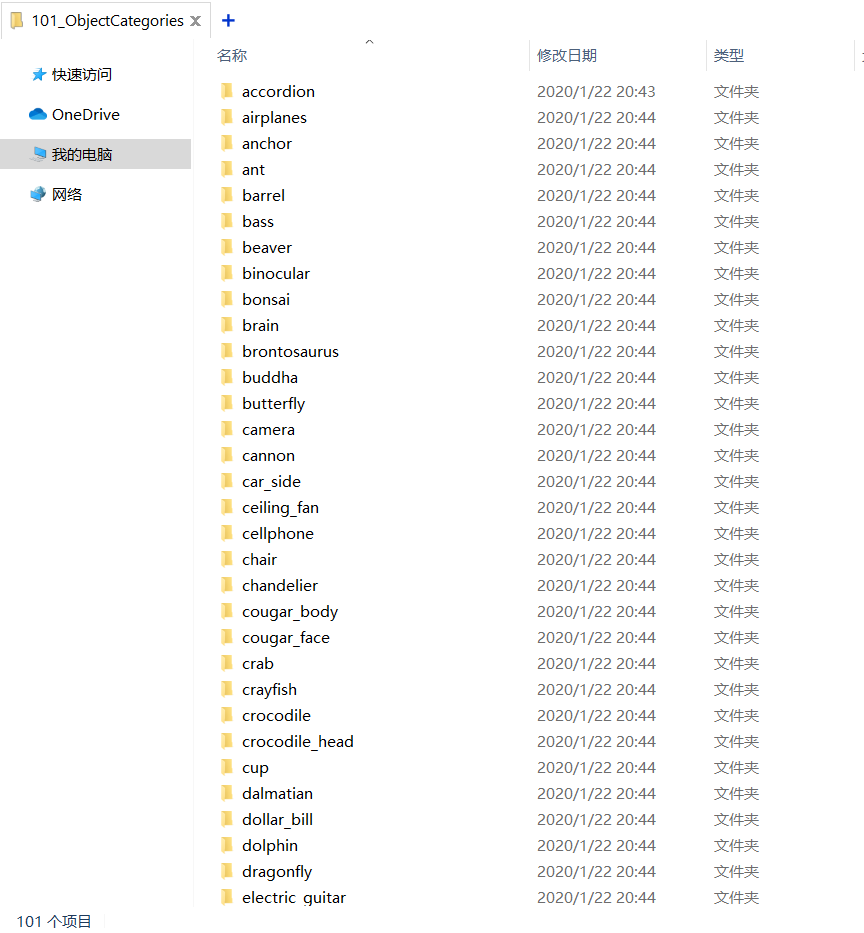

# Fastai数据准备


## 简介
数据是深度学习的立足之本，本文主要介绍Fastai框架如何进行数据加载与数据预处理。


## 模块划分
在之前的[Fastai简介文章](https://zhouchen.blog.csdn.net/article/details/89817650)我提到过，Fastai最核心的API是按照应用领域（任务类型）进行划分的，打开[官方文档](https://docs.fast.ai/applications.html)也会看到Fastai最核心的思路：**在一个`DataBunch`（Fastai的数据加载器）上训练一个`Model`对象，是非常简单的，只需要将数据和模型绑定到一个`Learner`对象即可。**

在Fastai的设计中，主要有四大应用领域，对应的四个模块名为`collab`（协同过滤问题）、`tabular`（表格或者结构化数据问题）、`text`（自然语言处理问题）以及`vision`（计算机视觉问题）。**本系列所有文章围绕都是图像数据进行处理，也就是说主要使用`vision`模块。****本系列所有文章围绕都是图像数据进行处理，也就是说主要使用`vision`模块。**

而在`vision`模块中，主要有如下几个模块：`data`（数据集构建）、`models`（预定义模型结构，依赖torchvision）、`learner`（学习器，将模型和数据关联起来，定义了大量回调函数）、`transform`（数据预处理，包括常见数据增广手段）等。


## 数据集构建
为了契合Fastai的API设计，这里并没有像之前Pytorch系列和Keras系列那样重构数据集为三个文件夹（对应训练集、验证集和测试集），这是考虑到Fastai的自动训练集划分的API的介绍，事实上划分数据集文件夹也是可以的，只不过多几个`DataBunch`对象而已。

关于数据集读取的API都在`fastai.vision.data`模块下，该模块定义了一个类`ImageDataBunch`用于处理大量的`Image`对象，这里的`Image`对象也是由`fastai.vision.data`模块下定义的一种Image类，它包含一个图片的矩阵表示、路径、维度、尺寸等属性，也包含图像显示、旋转、缩放、变换等。此外，Fastai依旧定义了不少具体视觉任务的类如用于图像分割的`ImageSegment`、用于检测的`ImageBBox`、用于关键点定位的`ImagePoints`等。

在Fastai中数据集的处理都是基于`DataBunch`类的，`ImageDataBunch`是其子类，封装了很多具体的适合计算机视觉使用的方法。而在Fastai中数据的导入一般通过[`data_block API`](https://docs.fast.ai/data_block.html)实现，不过，对于常见的CV数据集格式，`ImageDataBunch`已经做了封装，无需进行繁琐的API编写。这些函数用于从固定格式的文件中获取图像数据，返回的也是`ImageDataBunch`对象，具体如下。

### Folder（文件夹）
```python
ImageDataBunch.from_folder(
  path:PathOrStr,   # 数据集根目录
  train:PathOrStr='train',   # 训练集子目录
  valid:PathOrStr='valid',   # 验证集子目录
  test:Union[Path, str, NoneType]=None,   # 测试集子目录
  valid_pct=None,   # 验证集划分比例
  seed:int=None,   # 验证集随机划分种子
  classes:Collection[T_co]=None,  # 加载哪些类 
  **kwargs:Any)
```

从Imagenet风格的数据集内加载图像，文件存储必须是如下格式，其中`train`、`valid`和`test`参数指定对应数据集的子文件夹名，如训练集为`tra`文件夹那么则需要指定`train='tra'`。
```
path\
  train\
    class1\
    class2\
    ...
  valid\
    class1\
    class2\
    ...
  test\
```

当然，如果数据集是本文案例的Caltech101的格式（下面所示），那么只需要简单指定`valid_pct`作为划分训练集和验证集时验证集占整个数据集的比例即可，`seed`参数指定随机划分种子，便于复现结果。
```
path\
  class1\
  class2\
  class3\
```


执行下面的代码。
```python
from fastai import vision

data = vision.ImageDataBunch.from_folder("../data/101_ObjectCategories/", valid_pct=0.2, size=224)
print(data)
train_ds = data.train_ds  # 取出训练集
valid_ds = data.valid_ds  # 取出测试集
```

结果如下，生成了训练集和验证集（包括数据列表和类别列表）。
```
ImageDataBunch;

Train: LabelList (6942 items)
x: ImageList
Image (3, 224, 224),Image (3, 224, 224),Image (3, 224, 224),Image (3, 224, 224),Image (3, 224, 224)
y: CategoryList
accordion,accordion,accordion,accordion,accordion
Path: ..\data\101_ObjectCategories;

Valid: LabelList (1735 items)
x: ImageList
Image (3, 224, 224),Image (3, 224, 224),Image (3, 224, 224),Image (3, 224, 224),Image (3, 224, 224)
y: CategoryList
dollar_bill,umbrella,Motorbikes,pigeon,nautilus
Path: ..\data\101_ObjectCategories;

Test: None
```

上面的代码在参数中加入了size参数，该参数表示将图像的宽度和高度调整为指定尺寸，并且指定df_tfms可以自定义预处理方法。而且，通过属性获取的操作得到了具体的训练集和验证集，这会得到一个`LabelList`对象，对其索引可以得到图像和标签，如`img, label = train_ds[0]`，其中`img`就是一个Fastai的`Image`对象。


### DataFrame（表格说明文件）
```python
ImageDataBunch.from_folder(
  path:PathOrStr,  # 数据集根目录
  df:DataFrame,   # 包含文件路径和标签的DataFrame
  folder:PathOrStr=None,  # 相对于Path的数据存放的子目录
  label_delim:str=None,  # 标签分隔符
  valid_pct:float=0.2,   
  seed:int=None, 
  fn_col:IntsOrStrs=0,  # 文件名列的名称或者索引号
  label_col:IntsOrStrs=1,   # 标签列的名称或者索引号
  suffix:str='',  # 添加的文件名后缀
  **kwargs:Any)
```

通过DataFrame获取整个数据集信息，大多数参数同上一节（下文不再说明）。

其针对的数据格式一般如下
```
path\
  data\
  description.csv
```

### CSV（表格说明文件）
```python
ImageDataBunch.from_csv(
  path:PathOrStr, 
  folder:PathOrStr=None, 
  label_delim:str=None, 
  csv_labels:PathOrStr='labels.csv',   # 如果有单独的标签CSV文件可以这样指定
  valid_pct:float=0.2, 
  seed:int=None, 
  fn_col:int=0, label_col:int=1, 
  suffix:str='', 
  delimiter:str=None, 
  header:Union[int, str, NoneType]='infer', 
  **kwargs:Any)
```
直接从CSV文件中读取数据集，省去读取为DataFrame的步骤。

### 文件名
很多数据集存储方式是不同的，有些数据集的标签就存放在文件名中，下面定义的三个方法用于从文件名中提取出标签。

```python
ImageDataBunch.from_name_re(
  path:PathOrStr,  # 文件所在路径
  fnames:FilePathList,  文件名列表
  pat:str,  # 匹配模式
  valid_pct:float=0.2,  # 同上 
  **kwargs)
```
从文件名中按照正则表达式提取标签。

```python
ImageDataBunch.from_name_func(
  path:PathOrStr, 
  fnames:FilePathList, 
  label_func:Callable,  # 标签提取函数
  valid_pct:float=0.2, 
  seed:int=None, 
  **kwargs)
```
根据指定的标签提取函数（自行定义）来从文件名中提取标签。

```python
ImageDataBunch.from_lists(
  path:PathOrStr, 
  fnames:FilePathList, 
  labels:StrList,  # 标签列表
  valid_pct:float=0.2, 
  seed:int=None, 
  item_cls:Callable=None, 
  **kwargs)
```
需要传入一个和`fnames`同等大小的列表，依次为每个文件指定标签。


## 数据增强
上一节介绍了构建Fastai中数据集导入部分最为核心的`DataBunch`的几种常见方法，它就是输入模型的数据了。但是，在输入模型数据之前我们往往会对图像数据进行各种变换，称为数据增强（Data Augmentation）。数据增强本质上其实就是一种正则化，不过发生在数据层面而已。

### Transform类
Fastai定义了大量的图像变换函数，通过实例化这些函数对象可以直接对图像数据进行操作。但是这些基础的变换函数都是以`_`开头的函数如`_brightness(x, change)`表示改变图像的亮度函数，注意是个**函数**。但是实际进行数据增强的时候往往要增加一些随机性（如随机进行翻转），所以Fastai提供了一个对这些变换进行封装的类`fastai.vision.image.Transform`。该类提供共有的特性如变换函数优先级等，这些封装好的变换都在`fastai.vision.transform`模块下，是不以`_`开头的一系列对象（由Transform的子类实例化） ，注意是**对象**，同时，所有这类封装都相比于原函数多了一个参数`p`，表示以概率`p`进行变换，如果`p`是区间则从区间内随机选择作为概率。可以通过该对象的`call`方法对图像数据进行处理，如使用`brightness(x, change)`。 

### 图像变换
下面描述具体的图像变换手段，主要介绍的都是图像变换**对象**，变换函数只是少了概率参数`p`而已。
```python
brightness(x, change:uniform)
```
对图像进行亮度调整，按照`change`的数值进行，其值为1表示图像为白色，为0表示黑色，为0.5表示无变化，可在0与1之间调整。

```python
contrast(x, scale:log_uniform)
```
对图像进行对比度调整，`sacle`表示调整量，当其值为0会将图片转为灰度图，其值为1不调整对比度，大于1会增大对比度。

```python
crop(x, size, row_pct:uniform=0.5, col_pct:uniform=0.5) 
```
对图像进行裁减，按照中心位置`(row_pct, col_pct)`把图像裁减一个大小为`size`的patch，这两个位置值以归一化格式表示。

```python
crop_pad(x, size, padding_mode='reflection', row_pct:uniform=0.5, col_pct:uniform=0.5)
```
和`crop`类似，不过当裁减图像大于原始图像，会自动进行填充，填充方法为'zeros', 'border'或者'reflection'。

```python
dihedral(x, k:partial(uniform_int, 0, 7))
```
进行图像翻转并伴有一个k*90度的旋转。

```python
dihedral_affine(k:partial(uniform_int, 0, 7))
```
效果同上，返回的类型不同，当目标是`ImageBBox`或者`ImagePoints`时使用。

```python
flip_lr(x)
```
水平镜像翻转图片。

```python
flip_affine()
```
同上面的以`_affine`为结尾的含义。

```python
jitter(c, magnitude:uniform)
```
邻域像素替换，邻域范围由`magnitude`参数指定。

```python
pad(x, padding:int, mode='reflection')
```
图像填充，填充模式三种：`zeros`（0填充）、`border`（边角填充）以及默认的`reflection`（反射填充）。

```python
perspective_warp(c, magnitude:partial(uniform, size=8)=0, invert=False)
```
透视变换，`magnitude`是8元组参数，表示四个角归一化坐标的变换幅度。

```python
Image.resize(self, size:Union[int,TensorImageSize])
```
引用自Torch的图像缩放，size为整数（正方形）或者`(3,H,W)`格式。

```python
rotate(degrees:uniform)
```
图像旋转，指定角度即可。

```python
rgb_randomize(x, channel:int=None, thresh:float=0.3)
```
随机化RGB的某一通道，可以设置最大阈值。

```python
skew(c, direction:uniform_int, magnitude:uniform=0, invert=False)
```
图像扭曲，可以指定方向和幅度。

```python
squish(scale:uniform=1.0, row_pct:uniform=0.5, col_pct:uniform=0.5)
```
图像拉伸，`scale<1`为横向拉伸，`scale>1`为纵向拉伸。

```python
symmetric_warp(c, magnitude:partial(uniform, size=4)=0, invert=False)
```
指定的透视变换。

```python
tilt(c, direction:uniform_int, magnitude:uniform=0, invert=False)
```
倾斜。

```python
zoom(scale:uniform=1.0, row_pct:uniform=0.5, col_pct:uniform=0.5)
```
等比例缩放。

```python
cutout(x, n_holes:uniform_int=1, length:uniform_int=40)
```
孔洞产生。

### get_transforms()
该函数封装在`fastai.vision.transform`模块下，返回两个变换列表（每个列表包含一系列变换），用于训练集和验证集。

```python
get_transforms(do_flip:bool=True, flip_vert:bool=False, max_rotate:float=10.0, max_zoom:float=1.1, max_lighting:float=0.2, max_warp:float=0.2, p_affine:float=0.75, p_lighting:float=0.75, xtra_tfms:Optional[Collection[Transform]]=None)
```

该函数可以很方便地返回大量需要的变换用于数据集的载入，如使用下述代码构建用于随机翻转变换的数据集。

```python
from fastai.vision import transform, open_image, data
tfms = transform.get_transforms(do_flip=True)
data = data.ImageDataBunch.from_folder("../data/101_ObjectCategories/", valid_pct=0.2, size=224, ds_tfms=tfms)
train_ds, valid_ds = data.train_ds, data.valid_ds
```


## 补充说明
本文依据最新的[官方文档](https://docs.fast.ai/vision.data.html)讲解了Fastai中数据读入以及数据增强（[文档](https://docs.fast.ai/vision.transform.html)）的相关知识，具体代码开源于[我的Github](https://github.com/luanshiyinyang/Tutorial/tree/Fastai/)，欢迎star或者fork。
