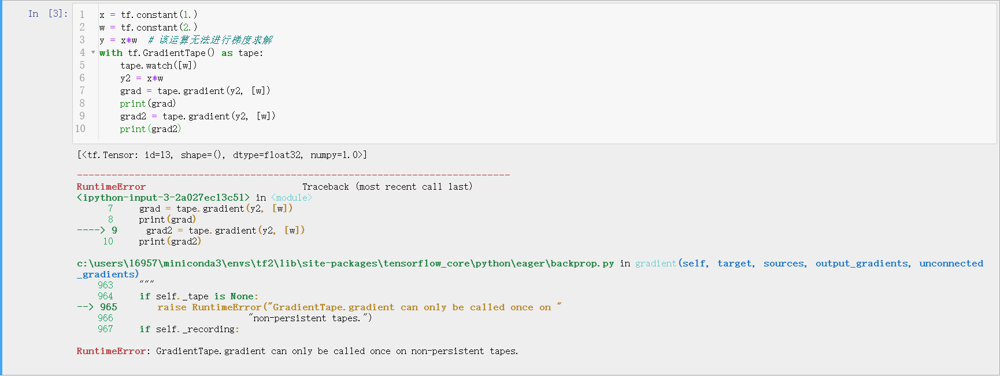
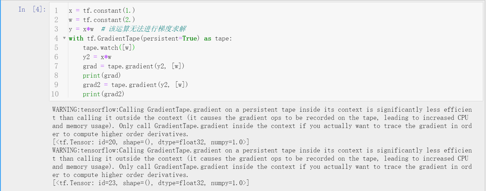

# TensorFlow2神经网络训练

## 梯度下降
- 梯度$\nabla f=\left(\frac{\partial f}{\partial x_{1}} ; \frac{\partial f}{\partial x_{2}} ; \ldots ; \frac{\partial f}{\partial x_{n}}\right)$指函数关于变量x的导数，梯度的方向表示函数值增大的方向，梯度的模表示函数值增大的速率。那么只要不断将参数的值向着梯度的反方向更新一定大小，就能得到函数的最小值（全局最小值或者局部最小值）。
$$\theta_{t+1}=\theta_{t}-\alpha_{t} \nabla f\left(\theta_{t}\right)$$  
- 上述参数更新的过程就叫做梯度下降法，但是一般利用梯度更新参数时会将梯度乘以一个小于1的学习速率（learning rate），这是因为往往梯度的模还是比较大的，直接用其更新参数会使得函数值不断波动，很难收敛到一个平衡点（这也是学习率不宜过大的原因）。
- 但是对于不同的函数，GD（梯度下降法）未必都能找到最优解，很多时候它只能收敛到一个局部最优解就不再变动了（尽管这个局部最优解已经很接近全局最优解了），这是函数性质决定的，实验证明，梯度下降法对于凸函数有着较好的表现。
- TensorFlow和PyTorch这类深度学习框架是支持自动梯度求解的，在TensorFlow2中只要将需要**进行梯度求解的代码段**包裹在GradientTape中，TensorFlow就会自动求解相关运算的梯度。但是通过`tape.gradient(loss, [w1, w2, ...])`只能调用一次，梯度作为占用显存较大的资源在被获取一次后就会被释放掉，要想多次调用需要设置`tf.GradientTape(persistent=True)`（此时注意及时释放资源）。TensorFlow2也支持多阶求导，只要将求导进行多层包裹即可。示例如下。

## 反向传播