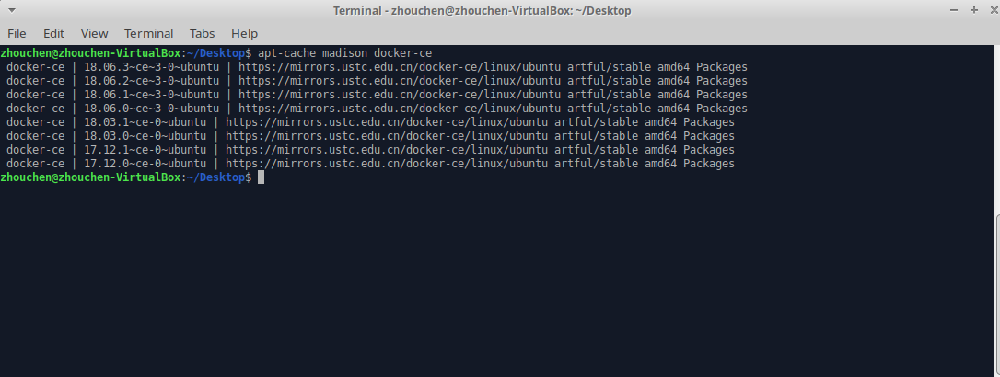
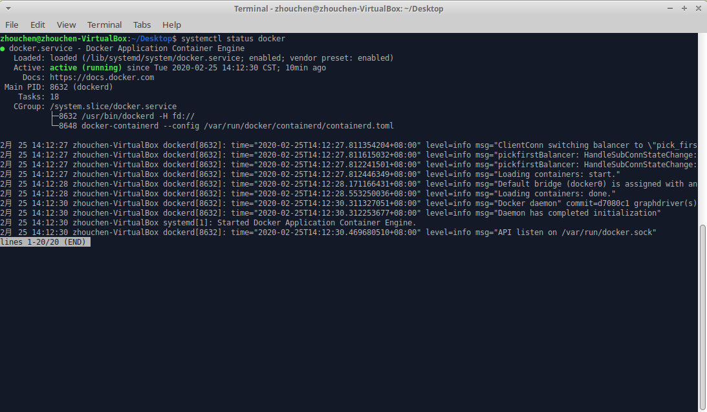
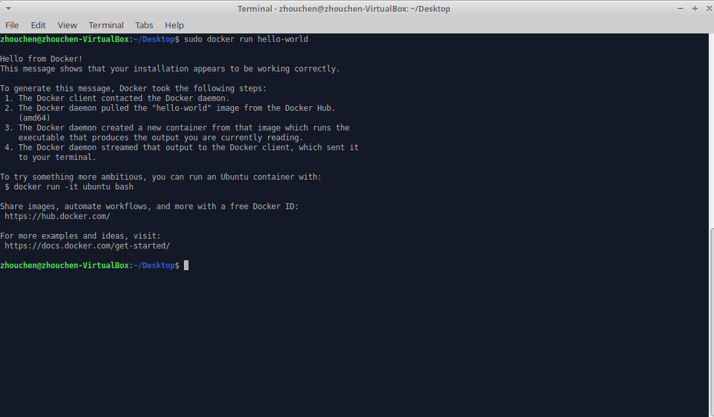
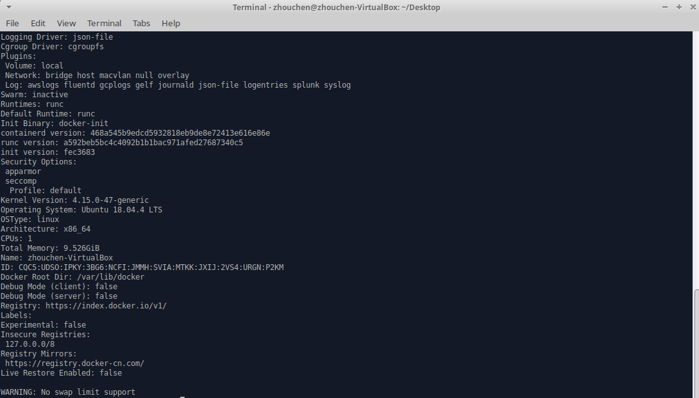

# Docker安装


## 简介
本文主要介绍在不同的平台下如何安装Docker，主要涉及平台为Ubuntu（Linux系统）和Windows10（Windows系统），最后会镜像国内源的使用。


## Ubuntu安装docker-ce
Docker支持主流的Ubuntu发行版（本文以Ubuntu 18.04LTS版本为例），现在的社区版称为docker-ce，在安装之前务必确认已经卸载了之前的版本，执行下面的命令卸载。

`sudo apt-get remove docker docker-engine docker.io containerd runc`

**目前主要有两种安装方法，一种是自行进行软件安装，另一种使用官方提供的脚本进行一键安装，不建议采用Shell脚本安装，因为脚本需要root权限执行，请仔细审核脚本文件。**

下面演示第一种方式安装docker-ce，方法参考百度上很多主流的方法。
### 安装所需软件包
- `sudo apt-get update`
- `sudo apt-get install -y apt-transport-https ca-certificates software-properties-common curl`

### 添加GPG密钥并添加docker-ce国内源
- `curl -fsSL https://mirrors.ustc.edu.cn/docker-ce/linux/ubuntu/gpg | sudo apt-key add -`
  - 显示OK表示添加成功，否则无法连接至对应网站，使用其他源即可。
- `sudo add-apt-repository "deb [arch=amd64] https://mirrors.ustc.edu.cn/docker-ce/linux/ubuntu artful stable"`
  - `sudo add-apt-repository "deb [arch=amd64] https://mirrors.ustc.edu.cn/docker-ce/linux/ubuntu $(lsb_release -cs) stable"`这个很多教程提到的命令由于Ubuntu18之后的docker包无法获取已经不能使用（文件目录修改了），必须使用上面的命令安装stable存储库。
- `sudo apt-get update`

### 安装最新版Docker-CE
- `sudo apt-get install -y docker-ce`
  - 安装当前系统可用的最新版docker-ce

可以通过`sudo apt-cache madison docker-ce`查看系统可安装的所有版本docker-ce，如下图。



其中，第一列是软件包名称，第二列是版本号，第三列是存储库名称，想要安装特定的版本只要包名后跟`=version`即可，如`sudo apt-get install docker-ce=18.06.3~ce~3-0~ubuntu`。

### 验证安装
`systemctl status docker`查看docker服务状态，若成功安装应为服务启动状态，如下图，如服务未启动，使用`sudo systemctl start docker`命令启动服务。



最后，测试docker是否正常工作，运行经典的hello world程序（第一次运行会自动下载镜像到本地）。




## Windows安装
对Windows10专业版，Docker有专门的安装包了，需要在应用和功能中先开启Hyper-V功能。

### Toolbox安装
点击[链接](https://www.docker.com/get-docker)，选择Download Desktop and Take a Tutorial下载Windows版本，需要登录。下载完成后，安装exe文件即可，安装后Docker自动启动，也可以类似上面Ubuntu例子，运行hello world测试是否成功运行。


## Docker镜像加速
国内从DockerHub拉取镜像会比较慢，需要进行镜像加速，Docker官方和很多云服务商都提供镜像加速服务，Docker官方提供的中国镜像库为https://registry.docker-cn.com。

下面以Ubuntu18.04为例设置官方镜像加速，注意，不同服务商建议选用对应的镜像加速服务。
编辑配置文件`/etc/docker/daemon.json`，如没有该文件请新建，填入如下内容。
```json
{"registry-mirrors":["https://registry.docker-cn.com"]}
```
之后，重启服务。

`sudo systemctl daemon-reload`

`sudo systemctl restart docker`

重启成功后，通过`sudo docker info`查看信息，若存在如下内容代表设置成功。
```
Registry Mirrors:
 https://registry.docker-cn.com/
```




## 补充说明
本文主要介绍了Docker社区版的安装以及镜像加速的配置，后续会进一步介绍Docker的使用。
