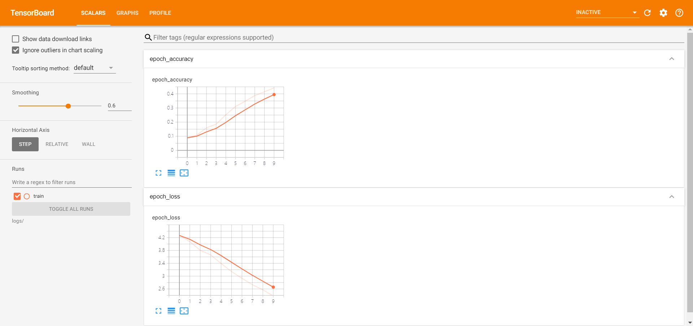
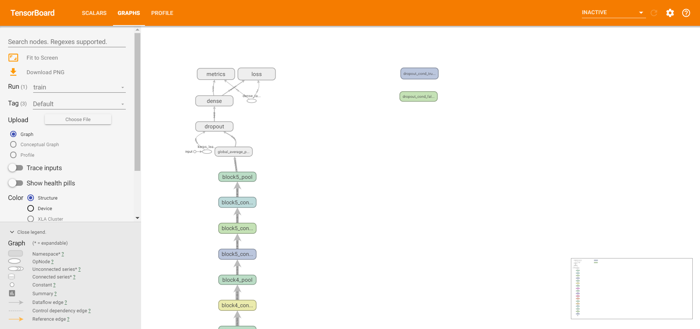

# Keras训练可视化

## 简介
在[上一篇文章](https://zhouchen.blog.csdn.net/article/details/89761230)中提到了模型训练的很多细节，最后的实战是在训练完成后可视化训练过程的，实际上对于大型深度学习项目，实时可视化训练状况是必要的。但是，由于Keras对训练过程封装程度非常高（高到只能调用fit这类函数进行训练），像动态图那样循环过程中不断写入log进行可视化是很难做到的，Keras在这方面提供了一个可视化的回调函数---TensorBoard。


## 训练可视化
在Keras中想要进行训练可视化最快速方便的选择就是其主模块TensorFlow支持的TensorBoard模块，该模块在较新版本的TensorFlow中默认安装，如没有需要自行使用pip安装。

首先，命令行打开TensorBoard的后台服务，在需要监控log文件夹的目录下执行命令`tensorboard --log_dir=logs/`即可，指定的日志文件夹需要与代码中回调函数设置的一致。

使用`keras.callbacks.TensorBoard(log_dir='./logs')`进行TensorBoard的文件写入，不需要像TensorFlow训练那样自己添加TensorBoard中的`graph`、`scalar`等，该函数唯一的参数是Keras自动写入TensorBoard日志的文件夹，TensorBoard服务监控的文件夹需要是该文件夹才行。

上述的回调提供了一种非常简单的使用TensorBoard进行可视化的方法，不需要用户设定日志文件名和写入日志文件，Keras会自动写入默认格式的日志文件。

下面以Caltech101数据集上的训练为例，演示可视化训练结果，代码如下。

```python
"""
Author: Zhou Chen
Date: 2020/3/24
Desc: desc
"""
import os
os.environ['TF_CPP_MIN_LOG_LEVEL'] = "2"
import tensorflow.keras as keras
from tensorflow.keras.layers import Input, GlobalAveragePooling2D, Dropout, Dense
from dataset import Caltech101


def build_model(input_shape, n_classes):
    input_tensor = Input(shape=input_shape)
    vgg = keras.applications.VGG16(include_top=False, weights=None, input_tensor=input_tensor)
    x = GlobalAveragePooling2D()(vgg.output)
    x = Dropout(0.5)(x)
    x = Dense(n_classes, activation='softmax')(x)

    model = keras.models.Model(input_tensor, x)
    return model


model = build_model((224, 224, 3), 101)
model.compile(loss='categorical_crossentropy', optimizer=keras.optimizers.Adam(3e-4), metrics=['accuracy'])

callbacks = [
    keras.callbacks.TensorBoard("./logs")
]

train_gen, valid_gen, test_gen = Caltech101()

model.fit_generator(
    train_gen, steps_per_epoch=train_gen.n// train_gen.batch_size,
    epochs=50,
    callbacks=callbacks
)

```

Keras封装的默认TensorBoard日志文件输出包括几个指标每轮的变化以及模型结构示意图。






## 补充说明
本文主要介绍Keras中如何使用TensorBoard进行训练可视化，具体代码开源于[我的Github](https://github.com/luanshiyinyang/Tutorial/tree/Keras)，欢迎star或者fork。